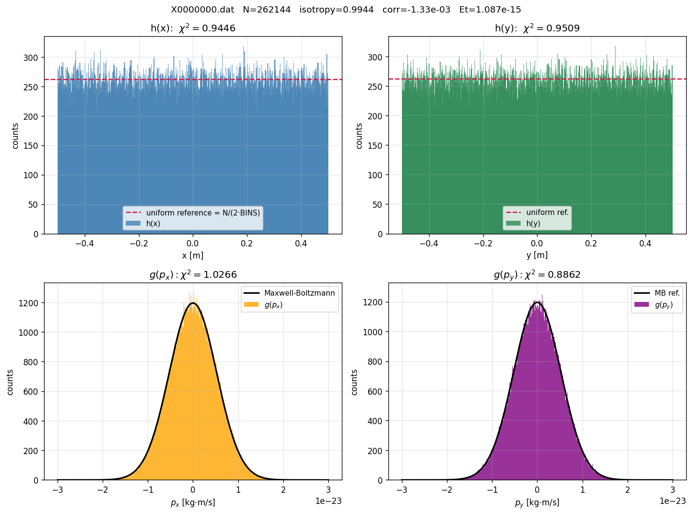
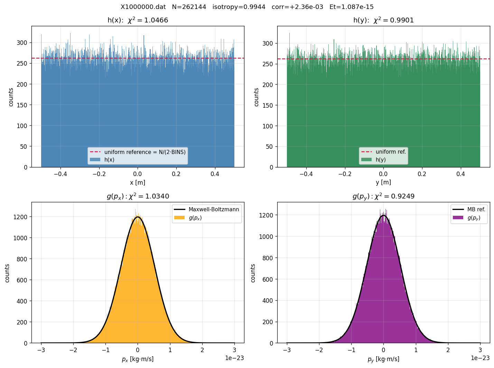
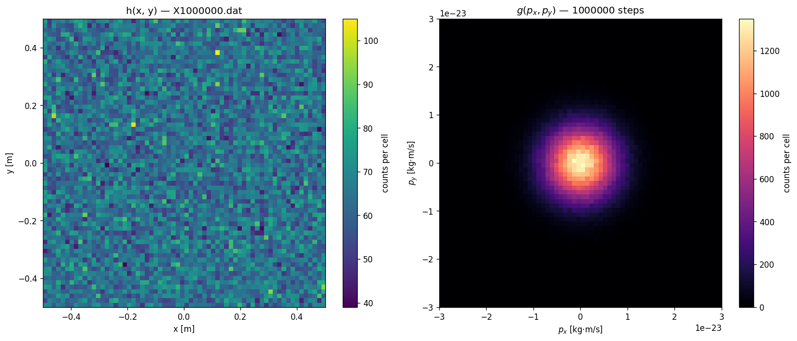
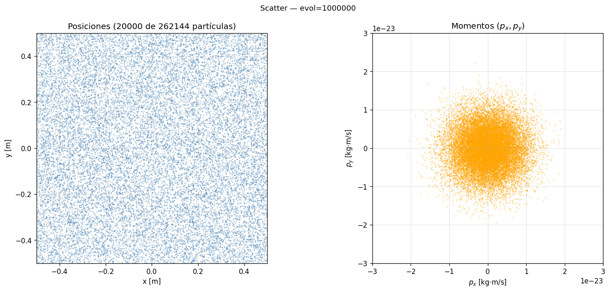
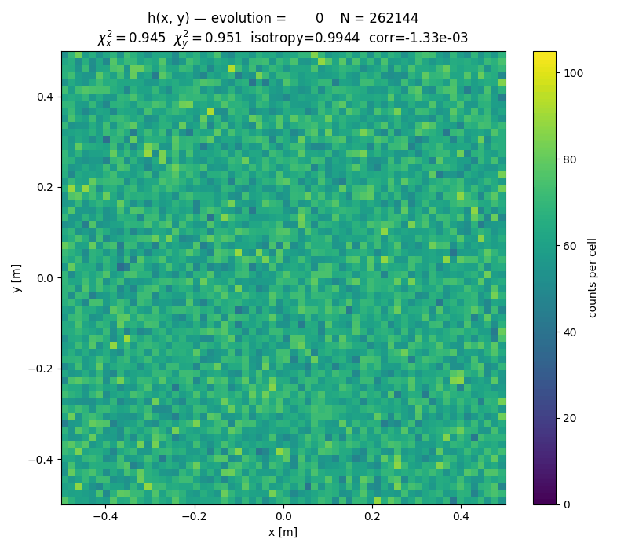
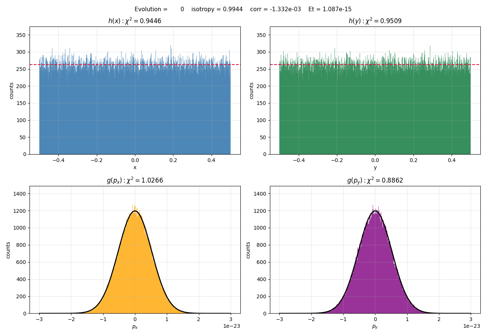
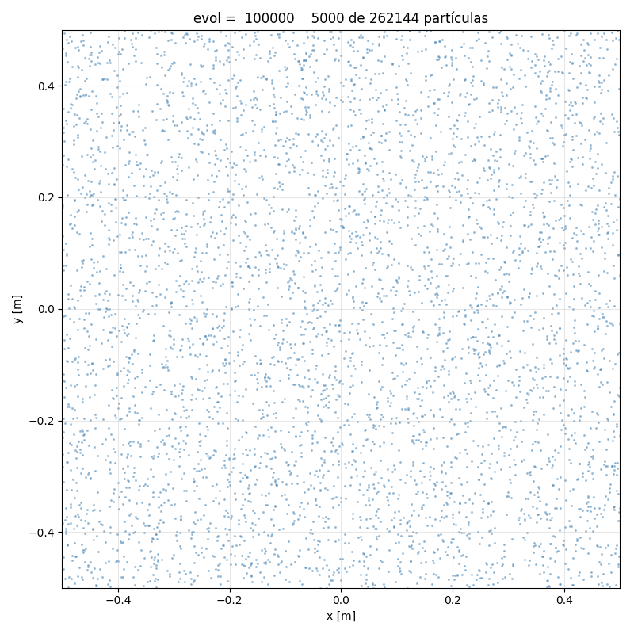
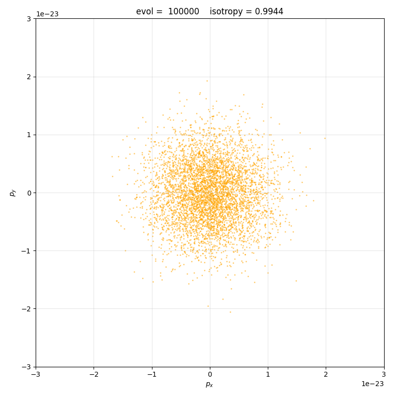

# Galería de figuras

Salida del toolkit `tools/plot` y `tools/animate`. Todas las figuras se
pueden regenerar con los comandos en cada sección.

## Régimen de relajación ($\alpha = 10^{-4}, \sigma_L = 10^{-4}$)

Corrida: $N = 2^{18} = 262\,144$, 1M pasos en 10 batches. Las
partículas arrancan distribuidas uniformemente en posición y con
momentos gaussianos de las condiciones iniciales, y evolucionan hasta
equilibrio térmico.

### Dashboard combinado

Vista global en un solo PNG: marginales de posición y momento,
heatmap del joint $h(x,y)$, joint $g(p_x, p_y)$ desde partículas,
distribución radial $|\vec{p}|$, distribución angular $\theta$,
deriva de energía a lo largo de los 11 snapshots.

Comando: `./tools/plot dashboard X1000000.dat --dump graba.dmp.1000000`

### Marginales: inicial vs final

Inicial — distribuciones todavía con sello de las condiciones iniciales:

Final — convergencia a uniforme en $x, y$ y a Maxwell-Boltzmann en $p_x, p_y$:

### Joint $h(x,y)$ y $g(p_x, p_y)$

### Distribución radial $|\vec{p}|$ vs Rayleigh

### Distribución angular $\theta = \arctan(p_y / p_x)$

### Scatter: posiciones y momentos (subsampleados)

### Deriva de energía (relax)

### Animaciones (relax)

| Nombre | Descripción |
|---|---|
|  | Heatmap $h(x,y)$ evolucionando. |
|  | Marginales convergiendo. |
|  | Posiciones de 5000 partículas evolucionando. |
|  | Momentos $(p_x, p_y)$ relajando. |

## Régimen periódico ($\alpha = 0, \sigma_L = 0$)

Corrida: $N = 2^{16} = 65\,536$, 500 k pasos. Energía conservada
**bit-for-bit** en los 11 snapshots (cf. test de periodicidad).

### Dashboard

### Deriva de energía (periodic)

Idealmente cero (energía bit-conservada). Lo verifica visualmente:

### Animaciones (periodic)

| Nombre | Descripción |
|---|---|
|  | Heatmap $h(x,y)$ — sin disipación, no relaja a uniforme exacto sino a phase-mixed. |
|  | Posiciones de 3000 partículas en régimen determinista. |
|  | Momentos $(p_x, p_y)$ — los signos cambian pero las magnitudes no. |
