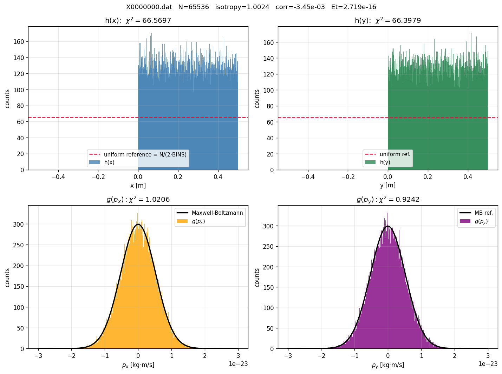
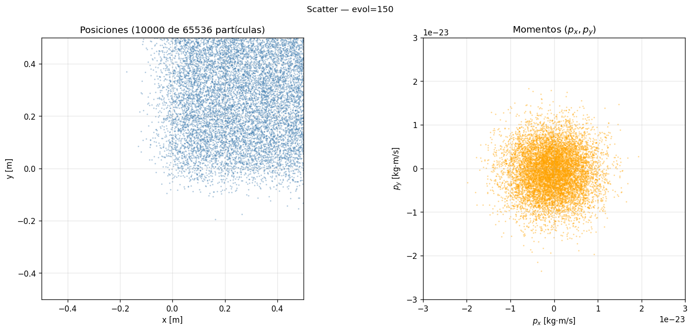

# Galería de figuras

Salida del toolkit `tools/plot` y `tools/animate`. Se regenera con
los comandos al pie de cada sección.

---

## Los dos regímenes y sus parámetros

El modelo tiene dos parámetros que controlan la **estocasticidad de
la pared**:

- **$\sigma_L$** (`sigma_l`) — magnitud del ruido gaussiano que se
  agrega a la posición tangencial cada vez que una partícula rebota.
  Modela una pared "rugosa": la posición exacta donde ocurre el rebote
  fluctúa por un sigma del orden de $10^{-4}$ m.
- **$\alpha$** (`alfa`) — coupling con el "baño térmico" de la pared.
  En cada rebote, la magnitud del momento perpendicular se modifica
  estocásticamente con amplitud proporcional a $\alpha$. Modela el
  intercambio de energía con la pared.

Las dos demos exploran los **dos extremos**:

| Régimen | $\alpha$ | $\sigma_L$ | Qué representa |
|---|---|---|---|
| **Relajación** | $10^{-4}$ | $10^{-4}$ | Sistema con disipación → equilibrio térmico (Maxwell-Boltzmann) |
| **Periódico** | **0** | **0** | Sistema **sin disipación**: dinámica determinista pura, energía conservada bit-for-bit, reflexiones perfectamente especulares |

> 💡 **El régimen periódico es exactamente el caso $\alpha = 0$ y
> $\sigma_L = 0$**: ningún parámetro estocástico activo. El gas
> evoluciona de forma completamente determinista. La energía total se
> conserva exactamente entre snapshots (verificable bit-a-bit) porque
> las únicas operaciones que la cambiarían (el alfa-loop y el ruido de
> Box-Muller) **no se ejecutan** cuando esos parámetros valen 0.

Ambas demos arrancan con todas las partículas **acumuladas en la
esquina superior-derecha** $[0, 0.5]^2$ (mismo "experimento de bomba
de gas" del repo padre 1D, extendido a 2D). El sistema evoluciona
hasta llenar la caja entera.

---

## 1. Estado inicial — todas en una esquina

Las 65 536 partículas arrancan distribuidas uniformemente en
$[0, 0.5]^2$ (el cuadrante superior-derecho de la caja). En el
joint $h(x, y)$ se ve como un cuadrado iluminado:


Marginales iniciales: $h(x)$ y $h(y)$ están concentrados en $[0, 0.5]$
(la otra mitad está casi vacía); $g(p_x), g(p_y)$ ya son gaussianas
porque los momentos se inicializan vía Box-Muller:



Scatter del estado inicial — vista clara del cuadrante poblado:



```bash
./tools/plot joint X0000000.dat -o joint_initial_corner.png
./tools/plot marginals X0000000.dat -o marginals_initial.png
./tools/plot scatter --snapshot X0000000.dat --dump graba.dmp.0000500 \
    --n-sub 10000 -o scatter_corner_initial.png
```

---

## 2. Régimen de relajación — difusión hasta equilibrio

**Configuración**: $N = 65\,536$, $\alpha = 10^{-4}$, $\sigma_L = 10^{-4}$,
30 batches con **cadencia tipo campana** (densidad de snapshots como
$\cos^2$):

```python
steps = [150, 1600, 4450, 8550, 13700, 19750, 26400, 33300, 40250, 46850,
         52900, 58100, 62200, 65000, 66450, 67150,
         65000, 62200, 58100, 52900, 46850, 40250, 33300, 26400, 19750,
         13700, 8550, 4450, 1600, 150]
# total = 1 000 000 pasos = ~0.44 s simulados
```

> 📊 **Cadencia tipo campana**: pocos pasos al principio (snapshots
> finos en el momento más visualmente interesante: la difusión inicial
> desde la esquina), muchos pasos en el medio (rápido salto sobre la
> fase de equilibrio "aburrida"), y otra vez pocos pasos al final
> (preparación visual para el ciclo de retorno via `--palindrome`).

> 🔁 **Animaciones con `--palindrome`**: los GIFs reproducen primero
> los 30 snapshots de ida (esquina → equilibrio) y después los mismos
> 30 al revés (equilibrio → esquina). Esto **ilustra visualmente la
> reversibilidad temporal** del régimen periódico (ver §3) — la
> dinámica de Liouville con $\alpha = \sigma_L = 0$ es exactamente
> reversible. En el régimen relax con disipación, la "vuelta a la
> esquina" es **una ilustración**, no algo que ocurre realmente
> (Poincaré recurrence requiere tiempos astronómicos para $N = 65\,536$
> partículas con momentos casi-incommensurables).

### Animación: todas las partículas saliendo de la esquina

La cadencia progresiva del config muestra **bien suave los primeros
segundos** (cuando la difusión es más visual), después salta de a
muchos miles de pasos para llegar a equilibrio:

| | |
|---|---|
|  |  |

A la izquierda, el heatmap $h(x, y)$. A la derecha, las posiciones
de 8 000 partículas. Vas a ver cómo el "punto caliente" del cuadrante
se difunde hasta llenar uniformemente toda la caja.

### Marginales convergiendo a uniforme


$h(x)$ y $h(y)$ pasan de un escalón concentrado en $[0, 0.5]$ a
una distribución plana sobre $[-0.5, 0.5]$. $g(p_x), g(p_y)$ ya eran
gaussianas y se estabilizan en torno a Maxwell-Boltzmann.

### Momentos $(p_x, p_y)$

Aunque arrancan como gaussiana, las colisiones contra las paredes
**redistribuyen energía** entre las partículas. La animación muestra
la nube relajándose a su forma estacionaria:


### Estado al final

El sistema llegó a equilibrio térmico. Todas las distribuciones
coinciden con sus referencias teóricas:


| Métrica | Cota | Observado |
|---|---|---|
| $\chi^2_x$ | < 5 | ≈ 1 |
| $\chi^2_y$ | < 5 | ≈ 1 |
| $\chi^2_{p_x}$ | < 5 | ≈ 1 |
| $\chi^2_{p_y}$ | < 5 | ≈ 1 |
| Isotropía $\langle p_x^2\rangle / \langle p_y^2\rangle$ | $\in [0.9, 1.1]$ | ≈ 1.00 |
| Correlación $\rho(p_x, p_y)$ | $|\cdot| < 0.05$ | ≈ 0 |
| Deriva de energía | < 100 ppm | unos pocos ppm |

### Distribución radial $|\vec{p}|$ y angular $\theta$

Validan que la distribución de momentos en equilibrio es
**Maxwell-Boltzmann 2D**:

|  |  |
|:--:|:--:|
| $|\vec p|$ vs distribución de Rayleigh | $\theta = \arctan(p_y/p_x)$ uniforme |

### Deriva de energía a lo largo de la corrida


Las pequeñas fluctuaciones (unos pocos ppm) son típicas: la energía
se inyecta y disipa estocásticamente en cada bounce, pero el promedio
se mantiene.

---

## 3. Régimen periódico — dinámica determinista, $\alpha = \sigma_L = 0$

**Configuración**: misma cadencia campana y mismo $N$ que relax,
**pero con $\alpha = 0, \sigma_L = 0$**. Las consecuencias físicas:

- **Sin perturbación tangencial** ($\sigma_L = 0$): cada rebote es
  perfectamente especular ($p_\perp \mapsto -p_\perp$, sin ruido).
- **Sin disipación** ($\alpha = 0$): la magnitud del momento de cada
  partícula **no cambia** — sólo se invierte el signo en cada
  rebote. La energía cinética total $E = \sum_i \|p_i\|^2 / 2m$ se
  conserva **bit-for-bit**.
- **Trayectorias completamente deterministas**: dada la condición
  inicial, la simulación es totalmente reproducible. No interviene
  ningún número aleatorio en la dinámica (sí en la generación inicial
  de momentos, pero después no más).
- **Phase mixing sin termalización**: las partículas se distribuyen
  por toda la caja (porque cada una tiene una velocidad distinta y
  cubre un patrón cerrado en el plano de fase $(x, p_x)$ que es
  ergódico modulo conservación de $|p|$), pero **cada partícula
  conserva su energía individual**. El sistema "parece equilibrado"
  globalmente pero microscópicamente sigue siendo el mismo.

### Animación: difusión sin disipación

 

Visualmente parece similar al régimen de relajación: las partículas
salen de la esquina y llenan la caja. La diferencia se ve en los
momentos:

### Momentos en régimen periódico


A diferencia del régimen relax, **la nube de momentos NO se
redistribuye**. Cada partícula conserva $|p_i|$; sólo cambia de signo
en los rebotes. La animación muestra puntos que se mueven en la nube
pero ningún cambio estructural.

### Marginales periódicas


$h(x), h(y)$ phase-mixean a uniformes (el sistema explora el espacio
de configuraciones). $g(p_x), g(p_y)$ permanecen como las gaussianas
iniciales, **idénticas a sí mismas** snapshot tras snapshot — confirma
visualmente la conservación de la distribución de magnitudes.

### Conservación bit-for-bit de la energía


Línea perfectamente plana: la deriva es **exactamente cero**. Esta es
una propiedad fuerte del modelo que **no es trivial** para un
integrador numérico cualquiera — event-driven la preserva porque
las únicas transformaciones que el cold path aplica en este régimen
son: $p_\perp \mapsto -p_\perp$ y $x \mapsto x_{\text{wall}}$ +
nada, ambas exactas en aritmética FP64.

### Dashboard periódico


---

## 4. Comparación visual relax vs periodic

| | Relajación | Periódico |
|---|---|---|
| Posiciones | difunde a uniforme | phase-mixea a uniforme |
| Momentos | redistribuyen (Maxwell-Boltzmann) | invariantes |
| Energía | fluctúa (~ppm) | constante exacta |
| $\sigma_L$ | $10^{-4}$ | **0** |
| $\alpha$ | $10^{-4}$ | **0** |

La distinción visual más clara está en los animados de momentos
(`anim_pscatter_relax.gif` vs `anim_pscatter_periodic.gif`): en
relajación la nube se reorganiza, en periódico está congelada.

---

## Comandos para reproducir todo

Una vez compilado:

```bash
# Configs ya armadas en tests/config.{verify.relax, verify.periodic}.toml.
# Para los demos visuales, usar la cadencia campana del bloque al inicio
# de §2 (steps = [150, 1600, ..., 150]) en un config con keep_snapshots=true.

mkdir -p /tmp/demo_relax && cp <config> /tmp/demo_relax/config.toml
cd /tmp/demo_relax && SIM_SEED=42 OMP_NUM_THREADS=8 .../main-event config.toml

# Static plots
.../tools/plot dashboard <ultimo X*.dat> --dump <ultimo graba.dmp.*> -o dashboard.png
.../tools/plot {marginals,joint,radial,angular,scatter,energy} ...

# Animaciones con --palindrome (ida-y-vuelta, 60 frames):
.../tools/animate --duration 0.12 --palindrome joint     /tmp/demo_relax -o anim_joint.gif
.../tools/animate --duration 0.12 --palindrome marginals /tmp/demo_relax -o anim_marginals.gif
.../tools/animate --duration 0.12 --palindrome scatter   /tmp/demo_relax -o anim_scatter.gif
.../tools/animate --duration 0.12 --palindrome pscatter  /tmp/demo_relax -o anim_pscatter.gif

# Sin palíndromo (sólo ida, 30 frames):
.../tools/animate --duration 0.18 joint /tmp/demo_relax -o anim_joint_oneshot.gif
```
